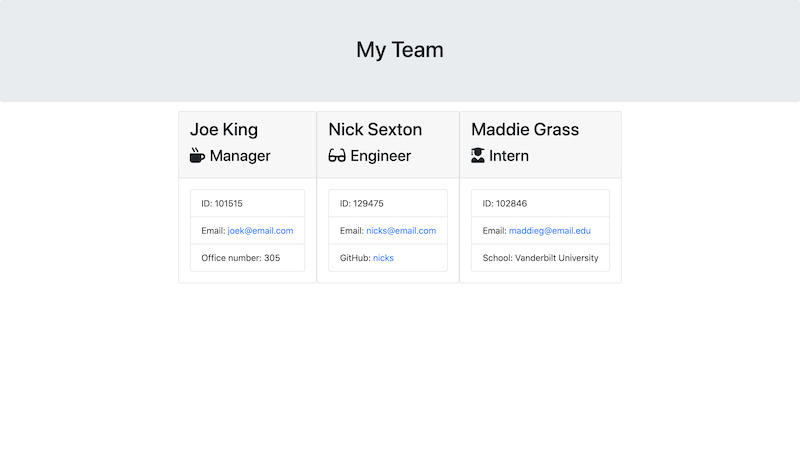

# Team Profile Generator
## Description
This application is a command-line application run with node.js. The app will create an HTML file with employee information gathered from a series of prompts. 

The user will be prompted with a series of basic questions regarding an employee. Specific questions are prompted depending on the role of an employee. After answering all the questions, the user has an option to create another employee. Once a user has created the desired number of employees, an HTML file will be generated displaying each employee in a Bootstrap card.

## Technologies
This application uses the following: Node.js, Inquirer, and Jest.

## Preview

## Screenshot
